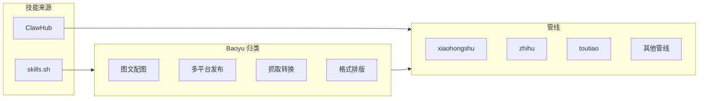

# 总技能文档（ClawHub + skills.sh + Baoyu 归类）

> 全仓库技能选型单一参考：统一呈现两来源、Baoyu 全表归类与使用场景，并索引各管线技能文档。各管线仍保留各自 CLAWHUB-SKILLS.md / SKILLS-SH-SKILLS.md（见 §3），本文档做汇总与索引。

## 1. 技能来源与选型

| 来源 | 搜索方式 | 安装命令 | 选型约定 |
|------|----------|----------|----------|
| **ClawHub** | [clawhub.ai/skills](https://clawhub.ai/skills)，按渠道搜如 `xiaohongshu`、`zhihu`、`toutiao` | `clawhub install <slug>` | **优先**选用；各管线见对应 CLAWHUB-SKILLS.md |
| **skills.sh** | [skills.sh](https://skills.sh/)，如 `?q=jimliu`、`?q=baoyu`、`?q=xiaohongshu` | `npx skills add <owner/repo> --skill <技能名>` | ClawHub 未覆盖时**后补**；Baoyu 完整列表见下节 |

- 安装后技能目录名需与 openclaw 配置中 `agents.list[].skills` 一致。
- **勿在 TOOLS.md 存凭证。**

## 2. Baoyu 全表（jimliu/baoyu-skills）18 项：归类 + 使用场景

来源：[skills.sh/?q=jimliu](https://skills.sh/?q=jimliu)。按功能归类，并给出可使用场景与典型管线。**以下 18 项都不能少**，选型时按管线按需选用，但清单以全量为准。

### 2.1 按类别总表

| 类别 | 技能名 | 安装量 | 可使用场景（简要） | 典型管线 |
|------|--------|--------|--------------------|----------|
| **图文/配图** | baoyu-image-gen | 10.5K | 通用文生图，配图、头图 | xiaohongshu, zhihu, toutiao, wechat-article |
| | baoyu-cover-image | 9.8K | 文章/帖子封面图，多比例与风格 | xiaohongshu, zhihu, toutiao, baijiahao, wechat-article |
| | baoyu-xhs-images | 9.7K | 小红书风格多图/信息图 | xiaohongshu |
| | baoyu-article-illustrator | 9.7K | 长文按结构配图 | xiaohongshu, zhihu, toutiao, baijiahao |
| | baoyu-infographic | 9.0K | 信息图/数据可视化图 | xiaohongshu, data-assistant 类 |
| | baoyu-comic | 8.9K | 知识漫画、教育漫画 | xiaohongshu, 内容二创 |
| **多平台发布** | baoyu-post-to-wechat | 10.4K | 公众号文章/贴图发布 | wechat-article |
| | baoyu-post-to-x | 9.3K | 发帖到 X (Twitter)，含 X Articles | 多平台分发 |
| | baoyu-post-to-weibo | 2.6K | 发帖到微博 | weibo |
| **抓取/转换** | baoyu-url-to-markdown | 8.8K | URL 抓取转 Markdown，拆解/热点抓取 | viral-breakdown, hot-monitor（各管线） |
| | baoyu-danger-x-to-markdown | 9.0K | X 等链接转 Markdown（逆向接口） | 热点抓取、素材采集 |
| | baoyu-danger-gemini-web | 8.6K | Gemini Web 生图/文本、多轮对话 | 配图/文案后备 |
| **格式/排版** | baoyu-format-markdown | 7.4K | 规范 Markdown 结构，报告/小结格式 | viral-breakdown, data-assistant（各管线） |
| | baoyu-markdown-to-html | 7.4K | Markdown 转排版 HTML（如公众号样式） | wechat-article, 发布前排版 |
| **素材/演示** | baoyu-slide-deck | 9.4K | 生成演示文稿配图/幻灯片 | 课件、对外材料 |
| **发布前处理** | baoyu-compress-image | 8.5K | 发布前图片压缩（体积/格式） | publisher（各管线） |
| **多语言** | baoyu-translate | 3.4K | 多语言翻译，多区域内容 | 国际化、多语种管线 |
| **技能维护** | release-skills | 9.1K | 技能包发布/版本管理（维护者用） | 仓库维护 |

### 2.2 关系示意



## 3. 各管线技能文档索引

管线内**优先看 ClawHub**，**后补看 skills.sh + Baoyu**；Baoyu 完整列表与归类以本文档 §2 为准。

| 管线 | CLAWHUB-SKILLS | SKILLS-SH-SKILLS | 说明 |
|------|----------------|------------------|------|
| xiaohongshu | [content-ops/xiaohongshu/CLAWHUB-SKILLS.md](../content-ops/xiaohongshu/CLAWHUB-SKILLS.md) | [content-ops/xiaohongshu/SKILLS-SH-SKILLS.md](../content-ops/xiaohongshu/SKILLS-SH-SKILLS.md) | 小红书七件套，ClawHub 优先 |
| zhihu | [content-ops/zhihu/CLAWHUB-SKILLS.md](../content-ops/zhihu/CLAWHUB-SKILLS.md) | [content-ops/zhihu/SKILLS-SH-SKILLS.md](../content-ops/zhihu/SKILLS-SH-SKILLS.md) | 知乎七件套 |
| toutiao | [content-ops/toutiao/CLAWHUB-SKILLS.md](../content-ops/toutiao/CLAWHUB-SKILLS.md) | [content-ops/toutiao/SKILLS-SH-SKILLS.md](../content-ops/toutiao/SKILLS-SH-SKILLS.md) | 头条号七件套 |
| baijiahao | [content-ops/baijiahao/CLAWHUB-SKILLS.md](../content-ops/baijiahao/CLAWHUB-SKILLS.md) | [content-ops/baijiahao/SKILLS-SH-SKILLS.md](../content-ops/baijiahao/SKILLS-SH-SKILLS.md) | 百家号四件套 |
| wechat-article | [content-ops/wechat-article/CLAWHUB-SKILLS.md](../content-ops/wechat-article/CLAWHUB-SKILLS.md) | [content-ops/wechat-article/SKILLS-SH-SKILLS.md](../content-ops/wechat-article/SKILLS-SH-SKILLS.md) | 公众号 |
| bilibili | [content-ops/bilibili/CLAWHUB-SKILLS.md](../content-ops/bilibili/CLAWHUB-SKILLS.md) | [content-ops/bilibili/SKILLS-SH-SKILLS.md](../content-ops/bilibili/SKILLS-SH-SKILLS.md) | B 站 |
| weibo | [content-ops/weibo/CLAWHUB-SKILLS.md](../content-ops/weibo/CLAWHUB-SKILLS.md) | [content-ops/weibo/SKILLS-SH-SKILLS.md](../content-ops/weibo/SKILLS-SH-SKILLS.md) | 微博 |
| juejin | [content-ops/juejin/CLAWHUB-SKILLS.md](../content-ops/juejin/CLAWHUB-SKILLS.md) | [content-ops/juejin/SKILLS-SH-SKILLS.md](../content-ops/juejin/SKILLS-SH-SKILLS.md) | 掘金 |
| discord | [channels/discord/CLAWHUB-SKILLS.md](../channels/discord/CLAWHUB-SKILLS.md) | [channels/discord/SKILLS-SH-SKILLS.md](../channels/discord/SKILLS-SH-SKILLS.md) | Discord |
| telegram | [channels/telegram/CLAWHUB-SKILLS.md](../channels/telegram/CLAWHUB-SKILLS.md) | [channels/telegram/SKILLS-SH-SKILLS.md](../channels/telegram/SKILLS-SH-SKILLS.md) | Telegram |
| wechat-video | [content-ops/wechat-video/CLAWHUB-SKILLS.md](../content-ops/wechat-video/CLAWHUB-SKILLS.md) | [content-ops/wechat-video/SKILLS-SH-SKILLS.md](../content-ops/wechat-video/SKILLS-SH-SKILLS.md) | 视频号 |
| douyin | [content-ops/douyin/CLAWHUB-SKILLS.md](../content-ops/douyin/CLAWHUB-SKILLS.md) | [content-ops/douyin/SKILLS-SH-SKILLS.md](../content-ops/douyin/SKILLS-SH-SKILLS.md) | 抖音七件套 |

## 4. 安装命令汇总（Baoyu）

仓库统一使用 **jimliu/baoyu-skills**。**18 项都不能少**，可按需只装子集，但全量安装见下方「完整 18 项」。

**完整 18 项（一键复制，一项不落）：**

```bash
npx skills add jimliu/baoyu-skills --skill baoyu-image-gen
npx skills add jimliu/baoyu-skills --skill baoyu-post-to-wechat
npx skills add jimliu/baoyu-skills --skill baoyu-cover-image
npx skills add jimliu/baoyu-skills --skill baoyu-xhs-images
npx skills add jimliu/baoyu-skills --skill baoyu-article-illustrator
npx skills add jimliu/baoyu-skills --skill baoyu-slide-deck
npx skills add jimliu/baoyu-skills --skill baoyu-post-to-x
npx skills add jimliu/baoyu-skills --skill release-skills
npx skills add jimliu/baoyu-skills --skill baoyu-infographic
npx skills add jimliu/baoyu-skills --skill baoyu-danger-x-to-markdown
npx skills add jimliu/baoyu-skills --skill baoyu-comic
npx skills add jimliu/baoyu-skills --skill baoyu-url-to-markdown
npx skills add jimliu/baoyu-skills --skill baoyu-danger-gemini-web
npx skills add jimliu/baoyu-skills --skill baoyu-compress-image
npx skills add jimliu/baoyu-skills --skill baoyu-markdown-to-html
npx skills add jimliu/baoyu-skills --skill baoyu-format-markdown
npx skills add jimliu/baoyu-skills --skill baoyu-translate
npx skills add jimliu/baoyu-skills --skill baoyu-post-to-weibo
```

以下按用途分组，便于按管线只装子集：

**通用内容管线常用（爆款拆解 + 二创/写作 + 发布前）：**

```bash
npx skills add jimliu/baoyu-skills --skill baoyu-url-to-markdown
npx skills add jimliu/baoyu-skills --skill baoyu-format-markdown
npx skills add jimliu/baoyu-skills --skill baoyu-cover-image
npx skills add jimliu/baoyu-skills --skill baoyu-article-illustrator
npx skills add jimliu/baoyu-skills --skill baoyu-compress-image
```

**小红书管线补充：**

```bash
npx skills add jimliu/baoyu-skills --skill baoyu-xhs-images
```

**公众号/多平台发布：**

```bash
npx skills add jimliu/baoyu-skills --skill baoyu-post-to-wechat
npx skills add jimliu/baoyu-skills --skill baoyu-markdown-to-html
npx skills add jimliu/baoyu-skills --skill baoyu-post-to-x
npx skills add jimliu/baoyu-skills --skill baoyu-post-to-weibo
```

**可选（配图扩展 / 抓取 / 多语言）：**

```bash
npx skills add jimliu/baoyu-skills --skill baoyu-image-gen
npx skills add jimliu/baoyu-skills --skill baoyu-slide-deck
npx skills add jimliu/baoyu-skills --skill baoyu-infographic
npx skills add jimliu/baoyu-skills --skill baoyu-comic
npx skills add jimliu/baoyu-skills --skill baoyu-danger-x-to-markdown
npx skills add jimliu/baoyu-skills --skill baoyu-danger-gemini-web
npx skills add jimliu/baoyu-skills --skill baoyu-translate
```

若 CLI 为 `npx skillsadd`（无空格），格式以 [skills.sh](https://skills.sh/) 文档为准。安装后技能目录名需与 config 中 `skills` 一致。

---

*Baoyu 完整列表见 [skills.sh/?q=jimliu](https://skills.sh/?q=jimliu)。*
